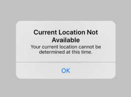
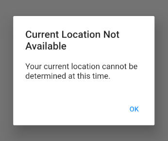
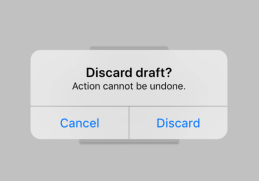
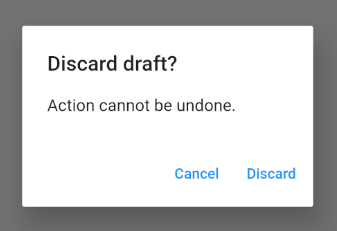
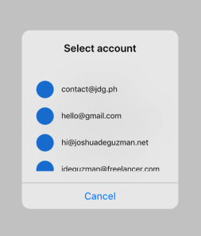
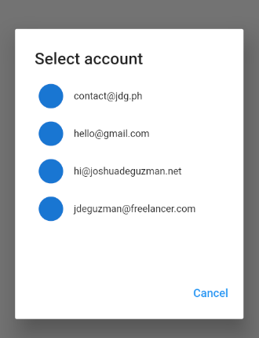

# flutter_dialogs

Platform aware dialog and alert widgets.

## Features

- Platform aware
- Extendable widgets
- Lightweight < 28 KB

## Usage

Sample Alert
```
showPlatformDialog(
  context: context,
  builder: (_) => BasicDialogAlert(
    title: Text("Current Location Not Available"),
    content:
        Text("Your current location cannot be determined at this time."),
    actions: <Widget>[
      BasicDialogAction(
        title: Text("OK"),
        onPressed: () {
          Navigator.pop(context);
        },
      ),
    ],
  ),
);
```
Output

|Android|iOS|
|---|---|
|||


Sample Confirmation
```
showPlatformDialog(
  context: context,
  builder: (_) => BasicDialogAlert(
    title: Text("Discard draft?"),
    content: Text("Action cannot be undone."),
    actions: <Widget>[
      BasicDialogAction(
        title: Text("Cancel"),
        onPressed: () {
          Navigator.pop(context);
        },
      ),
      BasicDialogAction(
        title: Text("Discard"),
        onPressed: () {
          Navigator.pop(context);
        },
      ),
    ],
  ),
);
```
Output

|Android|iOS|
|---|---|
|||

Sample List
```
showPlatformDialog(
  context: context,
  builder: (_) => BasicDialogAlert(
    title: Text("Select account"),
    content: Container(
      height: 200,
      child: ListView(
        children: <Widget>[
          _buildListSampleItem("contact@jdg.ph"),
          _buildListSampleItem("hello@gmail.com"),
          _buildListSampleItem("hi@joshuadeguzman.net"),
          _buildListSampleItem("jdeguzman@freelancer.com"),
        ],
      ),
    ),
    actions: <Widget>[
      BasicDialogAction(
        title: Text("Cancel"),
        onPressed: () {
          Navigator.pop(context);
        },
      ),
    ],
  ),
);
```
Output

|Android|iOS|
|---|---|
|||

## License

MIT [@joshuadeguzman](https://github.com/joshuadeguzman/flutter-dialogs/blob/master/LICENSE)
